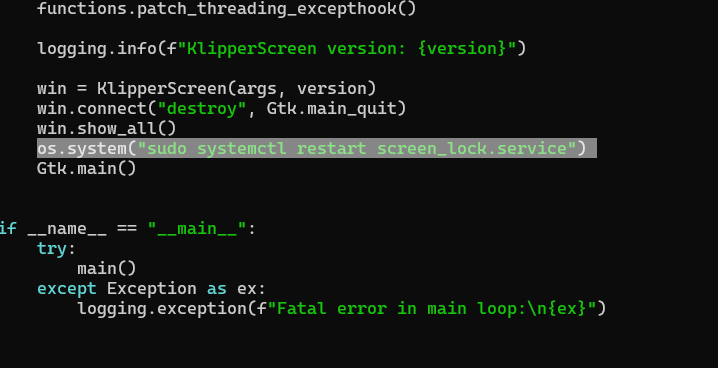

# KS_lock
Software for blocking access by key.

Для полноценной работы в KlipperScreen'е в файле sceen.py нужно добавить строчку:
os.system("sudo systemctl restart screen_lock.service")
в самый конец так как на фото:

